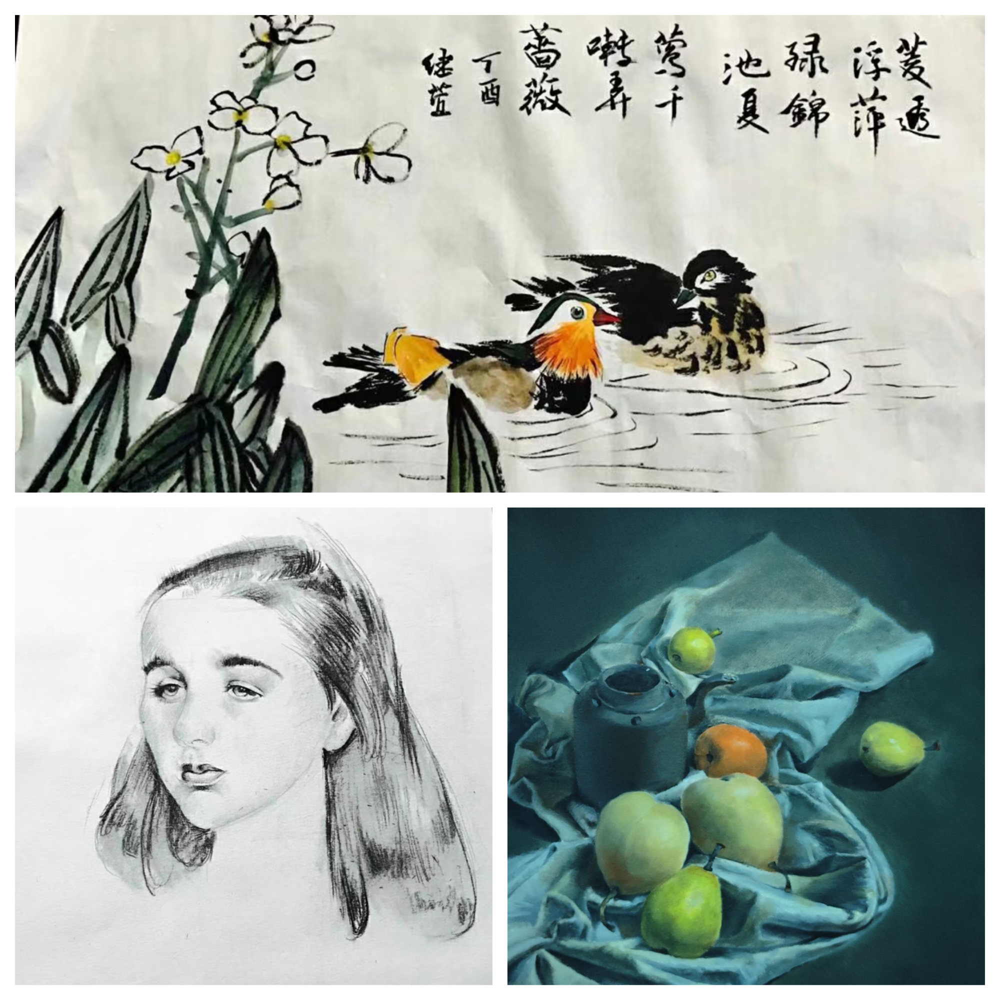
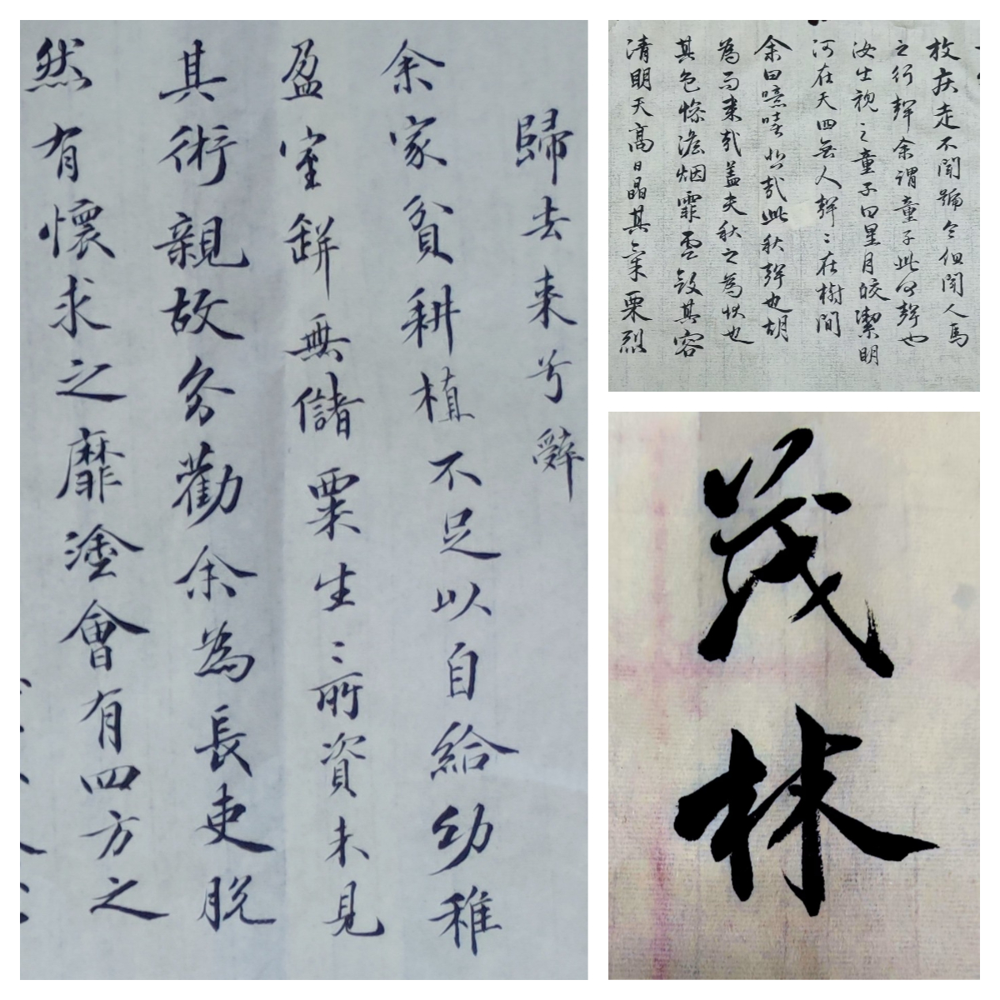

# Contact
**Email**

rjx08150100@gmail.com 
rjx08150100@mail.ustc.edu.cn 

**Phone**

+86 15067262816 

+01 8059719840

# Bio

I am a senior undergraduate from **School of the Gifted Young**, University of Science and Technology of China. I am also part of **Hua Xia Talent Program** in Computer Science and Technology. Currently, I am majoring in computer science, and my research interests include **quantum computing**, **compiler** and **operating systems**.

[[CV]](https://scarlett0815.github.io/resume.pdf)

# Research Experience

**2023-07 ~ now: Summer Intern in UCSD Prof. Yufei Ding's Group** 

We are building a compiler-centric optimization framework for **quantum computing**. This compiler is capable of  deploying quantum programs onto the hardware based on photonic quantum devices. My work is to optimize the performance of a basic framework proposed by Picasso Lab, OneQ: A Compilation Framework for Photonic One-Way Quantum Computation, from the perspectives of algorithms, diversity in resource states, and physical realism. 

My work could be checked on https://github.com/Scarlett0815/OneQ-Optimization. 

 

**2022-06~2022-08: Build a VR Office system based on Oculus** 

I took part in a small group consisted of several students interested in VR to build a office system based on Oculus. In this office system, we added the gesture recognition to Oculus and freed customers from the handlers. In addition, we realized 3 basic functions, which are 3D Object Importing, Remote Control as well as Model Plane. 

Our work could be seen on https://github.com/OSH-2022/VR-fancy-office. 

 

**2022-05~2022-11: USTC Robo Game** 

We have made a curling robot in 6 months, during which I was responsible for the recognition part as well as the tracking part. In this process, I used neural network to realized our recognition part for better robustness. 

Our work could be seen on https://github.com/WuTianming/robogame-code. 

 

**2022-12~2023-01: SysYF Compiler Design** 

I made a compiler based on LLVM architecture. I designed this compiler from the lexical level to the
final back end.  Also, I  optimized the register allocation part using graph coloring methods. 

My work could be checked on https://github.com/Scarlett0815/compile/tree/master/compile_llvm/. 

# Courses

Operating Systems (H): 97 

Computer Networks: 97 

Computer Programming A: 96 

Network System Experiment: 95 

Quantum Computing and Machine Learning: 93 

Principles and Techniques of Compiler(H): 92 

Introduction to Information Security: 92 

Foundations of Algorithms: 92 

Design and Practice of Robot: 93 

C Language Programming II: 93 

Analog and Digital Circuits: 90 

Graph Theory: 90 

Thermotics: 99 

Mechanics A: 90 

# Awards

* 2022-12: Huaxia Computer Science Talent Class Scholarship 
* 2022-11: Outstanding Student Scholarship Gold Award
* 2022-11: The Second Prize in USTC RoboGame
* 2022-04: Special Award for Girls in USTC Programming Competition(div1)
* 2021-12: The Second Prize of the Undergraduate Mathematics Contest
* 2021-12: China Collegiate Programming Contests for Girls Bronze Award
* 2021-09: Outstanding Student Scholarship Bronze Award
* 2021-06: Rose Light Scholarship
* 2020-12: Freshman third-class scholarship

# Teaching Assistant

**Computer Programming A**

Organized by Prof.Jie Shen    --2022Fall

Topic: C Programming, Introduction to Basic Data Structure, Foundation of Basic Algorithms

# Hobbies

**Jane Austen Enthusiast**

I'd like to recommend Jane Austen's works to every girl intending to know something about marriage and love.  From my perspective, her depiction of love is akin to delicate carving on a small piece of ivory but it is both genuine and imbued with strength.

**A Girl Enjoying Painting**

My passion for art extends beyond Chinese painting, sketching, oil painting, and quick sketches. Here are some of my works.

**Calligraphy Enthusiast**

I started practicing calligraphy at the age of six, and it has become an activity which brings me peace and joy. Here are some of my works.

